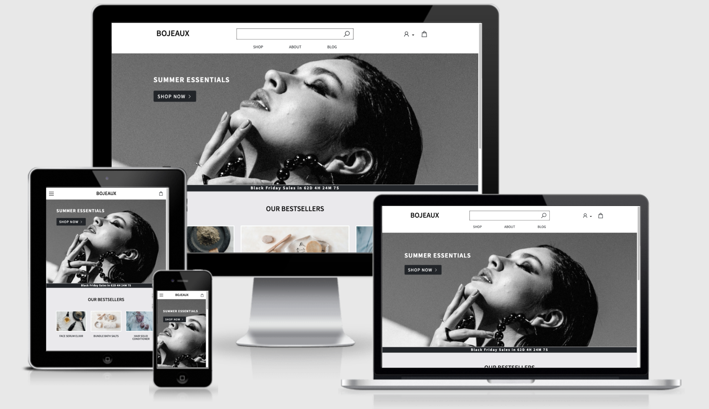

# BOJEAUX

View the live project [here](https://bojeaux-ms4.herokuapp.com/).

Bojeaux is a fictitious luxury beauty brand focused on hair, face and body products. Designed as my final project for Code Institute’s program, the main goal is to present a fully functional e-commerce site using Django and Stripe payments integration.

---

### **Contents** ###

- [UX](#ux-user-experience)
    - [User Stories](#user-stories)
    - [Design](#design)
        - [Wireframes](#wireframes)
        - [Information Architecture](#information-architecture)
        - [Fonts](#fonts)
        - [Colors and branding](#colors-and-branding)
- [Features](#features)
    - [Implemented](#implemented)
    - [To Implement](#to-implement)
- [Technologies Used](#technologies-used)
    - [Languages](#languages)
    - [Frameworks,Libraries and Programs](#frameworks-libraries-and-programs)
    - [General Resources](#general-resources)
- [Testing](#testing)
- [Deployment](#deployment)
    - [Run the project locally](#run-the-project-locally)
    - [Deploy the project to Heroku](#deploy-the-project-to-heroku)
- [Credits](#credits)
    - [Code solutions and inspiration](#code-solutions-and-inspiration)
    - [Content](#content)
    - [Media](#media)
    - [Acknowledgements](#acknowledgements)

## UX (User Experience) ##

### **User Stories** ###
| As a/an        | I want to...        | So that I can...        |
| ------------- |:-------------:| :-----:|
| SHOPPER| browse all available products on the site | find something to buy. |
|        | filter by product category|easily find what I am interested in.|
|        | search by keywords|find the products faster.|
|        | add and view products in my bag|know how much I am spending.|
|        | add products to a wishlist|come back later and find them easily.|
|        | get some sort of discount|afford to buy something extra maybe.|
|        | see my past orders|track how much I spend and buy some products again.|
|        | check the full list of ingredients|decide if the products are suitable for what I need.|
|        | sort the products by price|see the expensive/cheapest ones first.|
|        | get recommendations of similar products|discover new items that I could like.|
|        | read the most frequently asked questions|know about returning policy, free shipping and anything related to the products on the site.|
|        | have my shipping details on my profile|complete my purchase faster.|
|        | read articles related to the products|learn how to better use them and be up to date with beauty tips.|
|        | know more about the brand|decide if the founders are trustworthy and how legit the brand is.|
|        | register for an account that stores my info|return and navigate the site faster and more intuitively.|
|        | be able to reset my own password|retrieve access to my account.|
|        | receive an email with an order confirmation|have the relevant information and be sure everything went well with my purchase.|
| STORE OWNER| add, edit or/and delete products|add more products, make any updates to existing ones and/or delete products.|
|            | create coherence around my brand|build up a good number of returning loyal customers.|

### **Design** ###

#### **Wireframes** ####
The wireframes for the website have been created with [Figma](https://www.figma.com/) and are available [here](https://www.figma.com/file/TxA1czx6sYCXVmdOcjD8g2/MS4?node-id=0%3A1).Tablet and mobile devices share the same layout, while a separate design has been created for the desktop views. 
The design sketched in the original wireframes has very slightly changed in order to make the website more intuitive. Due to lack of time, I have decided not to detail all these small changes.

#### **Information Architecture** ####

Fixtures JSON files have been created and used to easily upload the products information into the database.
I have used SQLite for the development process and PostgreSQL for the deployed site. Static and media files are hosted in a AWS S3 bucket.
The project consists of eight Django apps:

- Bojeaux
- Home - displays home, about, ToU, privacy policy and FAQ pages
- Bag - displays the bag views and handles CRUD operations
- Products
    - Product Model - stores information on each product
    ```
    category = models.ForeignKey('Category', null=True, blank=True, on_delete=models.SET_NULL)
    sku = models.CharField(max_length=254, null=True, blank=True)
    name = models.CharField(max_length=254)
    description = models.TextField(max_length=1000)
    ingredients = models.TextField(max_length=500)
    price = models.DecimalField(max_digits=6, decimal_places=2)
    image = models.ImageField(null=True, blank=True)
    ```
    - Category Model - stores the product categories
    ```
    name = models.CharField(max_length=254)
    friendly_name = models.CharField(max_length=254, null=True, blank=True)
    ```
- Checkout 
    - Order Model - stores information on the order
    ```
    order_number = models.CharField(max_length=32, null=False, editable=False)
    user_profile = models.ForeignKey(UserProfile, on_delete=models.SET_NULL, null=True, blank=True, related_name='orders')
    full_name = models.CharField(max_length=50, null=False, blank=False)
    email = models.EmailField(max_length=254, null=False, blank=False)
    phone_number = models.CharField(max_length=20, null=False, blank=False)
    country = CountryField(blank_label='Country *', null=False, blank=False)
    postcode = models.CharField(max_length=20, null=True, blank=True)
    town_or_city = models.CharField(max_length=40, null=False, blank=False)
    street_address1 = models.CharField(max_length=80, null=False, blank=False)
    street_address2 = models.CharField(max_length=80, null=True, blank=True)
    county = models.CharField(max_length=80, null=True, blank=True)
    date = models.DateTimeField(auto_now_add=True)
    delivery_cost = models.DecimalField(max_digits=6, decimal_places=2, null=False, default=0)
    order_total = models.DecimalField(max_digits=10, decimal_places=2, null=False, default=0)
    grand_total = models.DecimalField(max_digits=10, decimal_places=2, null=False, default=0)
    original_bag = models.TextField(null=False, blank=False, default='')
    stripe_pid = models.CharField(max_length=254, null=False, blank=False, default='')
    ```
    - OrderLineItem - stores information on products in an order
    ```
    order = models.ForeignKey(Order, null=False, blank=False, on_delete=models.CASCADE, related_name='lineitems')
    product = models.ForeignKey(Product, null=False, blank=False, on_delete=models.CASCADE)
    quantity = models.IntegerField(null=False, blank=False, default=0)
    lineitem_total = models.DecimalField(max_digits=6, decimal_places=2, null=False, blank=False, editable=False)
    ```
- Blog 
    - Blog Model - stores information on each blog post
    ```
    title = models.CharField(max_length=150, unique=True)
    slug = models.SlugField(max_length=200, unique=True)
    author = models.CharField(max_length=40, null=True, blank=True)
    image = models.ImageField(null=True, blank=True)
    content = models.TextField()
    created_on = models.DateTimeField(auto_now_add=True)
    ```
- Profiles 
    - UserProfile Model - stores information on each user profile
    ```
    user = models.OneToOneField(User, on_delete=models.CASCADE)
    default_phone_number = models.CharField(max_length=20, null=True, blank=True)
    default_street_address1 = models.CharField(max_length=80, null=True, blank=True)
    default_street_address2 = models.CharField(max_length=80, null=True, blank=True)
    default_town_or_city = models.CharField(max_length=40, null=True, blank=True)
    default_county = models.CharField(max_length=80, null=True, blank=True)
    default_postcode = models.CharField(max_length=20, null=True, blank=True)
    default_country = CountryField(blank_label='Country', null=True, blank=True)
    ```
- Wishlist - stores information on user's wishlist
    - Wishlist Model
    ```
    user_profile = models.ForeignKey('profiles.UserProfile', on_delete=models.CASCADE, null=False, blank=False, related_name='wishlist')
    products = models.ManyToManyField('products.Product')
    ```
#### **Fonts** ####
Noto Sans KR font with a Sans Serif fallback has been chosen for the entire website.

#### **Colors and branding** ####
Black, grey and white are the main colors chosen for the brand, click [here](https://coolors.co/ffffff-eae9ec-000000) to see the palette.

According to La Reserve Magazine's [article](https://www.lareserve-mag.com/the-colors-of-luxury/) reflecting on the colors of luxury, choosing one iconic color and consistently using it throughout the products is key in communicating a strong high-end brand identity. In upscale fashion, black is timeless and looks sophisticated, just like explained in this [article](https://brandingcompass.com/branding/color-theory-black-as-a-branding-color/) by branding compass. Finally, pearly gray, similar to Dior's signature shade, is chic, modern and easily allows for incorporating more colors.

[Back to contents](#contents)

## Features ##
Bojeaux is a site made up of eight (including the Bojeaux app itself) Django applications, some of which are reused throughout the overall architecture. 

- Home
- Products
- Profiles
- Checkout
- Bag
- Blog
- Wishlist

### **Implemented** ###
- Responsive frontend design with Bootstrap including intuitive navigation architecture.
- Django all-auth (sign up, sign in, log out, password change).
- User profiles which allow for storing order history, (updating) shipping information and products added to the wishlist.
- Frontend UI for superuser to perform CRUD operations on the products, aside from the Django admin UI.
- User feedback (toasts) for interacting on the website (add/delete items from bag, logging in/out, updating the bag, finishing a payment).
- Automatic emails for user verification, password reset and order confirmation.
- Product filtering by category and sorting. 
- Bestsellers and similar products galleries.
- Black Friday countdown.
- Bag content and total amount.
- Payments via Stripe.
- Breadcrumbs to allow for easier site navigation.
- Blog app with curated content.
- Wishlist that allows logged in users to save favourite products to a wishlist.

### **To Implement** ###

- Implement pagination that allows for displaying the products across multiple pages.
- Handling account deletion/data requests.

[Back to contents](#contents)

## Technologies Used ##

### **Languages** ###
- [Python](https://www.python.org/)
- [HTML5](https://en.wikipedia.org/wiki/HTML5)
- [CSS3](https://en.wikipedia.org/wiki/CSS)
- [JavaScript](https://en.wikipedia.org/wiki/JavaScript)

### **Frameworks, Libraries and Programs** ###
- [Bootstrap](https://getbootstrap.com/) - used to design some elements on the pages as well as help with styling and responsiveness.
- [Figma](https://www.figma.com/) - used to create the wireframes.
- [Google Fonts](https://fonts.google.com/)
- [Coolors](https://coolors.co/) - used to generate the colors palette used throughout the website.
- [Favicon.io](https://favicon.io/) - used to generate the favicon.
- [Line Awesome](https://icons8.com/line-awesome) - used for the icons.
- [cdnjs](https://cdnjs.com/)
- [Hover.css](https://ianlunn.github.io/Hover/) - used for hoverable effects throughout the site.
- [Git](https://git-scm.com/) - used for version control.
- [GitHub](https://github.com/) - used to store the project's code.
- [Gitpod](https://www.gitpod.io/)
- [SQLite](https://www.sqlite.org/) - relational database used during development.
- [PostgreSQL](https://www.postgresql.org/) - relational database used for deployed site.
- [jQuery](https://jquery.com/)
- [Django](https://www.djangoproject.com/) - used to build the site.
- [Heroku](https://www.heroku.com/) - used to host the deployed site.
- [Stripe](https://stripe.com/nl) - used for the payments functionality.
- [AWS S3](https://aws.amazon.com/s3/) - used for storage of static and media files on the deployed site.
- [RandomKeygen](https://randomkeygen.com/) - used to generate passwords across the site.
- [Termly](https://termly.io/) - templates reused for the terms of use and privacy policy.
- [Autoprefixer](https://autoprefixer.github.io/)- used for adding CSS vendor prefixes to increase compatibility across browsers.
- [Django Secret Key Generator](https://miniwebtool.com/django-secret-key-generator/)

### **General Resources** ###

1. [Code Institute Course Content](https://learn.codeinstitute.net/dashboard)
2. Code Institute **Slack Community**
3. [Django documentation](https://docs.djangoproject.com/en/3.2/)
4. [Python Documentation](https://www.python.org/doc/)
5. [W3Schools](https://www.w3schools.com/)
6. [Stack Overflow](https://stackoverflow.com/)

[Back to contents](#contents)

## Testing ##
All testing for the website has been collected [here](https://github.com/MihaelaVacarus/bojeaux_ms4/blob/main/TESTING.md).

[Back to contents](#contents)

## Deployment ##
This project's code is stored on GitHub, the IDE chosen was Gitpod and deployment is done to Heroku.

### **Run the project locally** ###
1. From my project's [repo](https://github.com/MihaelaVacarus/bojeaux_ms4) on GitHub, download the files by clicking on "Code" and getting the zip folder. Alternatively, you can also clone the repo by running the command ```gh repo clone MihaelaVacarus/bojeaux_ms4``` from your IDE.
2. Open the project's folder and install all the requirements from the requirements.txt file with command ```pip3 install -r requirements.txt```.
3. Set up your environment variables in an env.py file (make sure to add this env.py file to the .gitignore file in the root directory) as per below:

```
os.environ["DEVELOPMENT"] = "True"
os.environ('STRIPE_PUBLIC_KEY', 'YOUR_STRIPE_PUBLIC_KEY')
os.environ('STRIPE_SECRET_KEY', 'YOUR_STRIPE_SECRET_KEY')
os.environ('STRIPE_WH_SECRET', 'YOUR_STRIPE_WH_SECRET')
os.environ('SECRET_KEY', 'YOUR_DJANGO_SECRET_KEY')
```

4. Migrate the models with the below commands in this same order:

```python3 manage.py makemigrations```

```python3 manage.py migrate```

5. Set up the database by loading the [fixtures](https://github.com/MihaelaVacarus/bojeaux_ms4/tree/main/products/fixtures) in the following order:

```python3 manage.py loaddata categories```

```python3 manage.py loaddata products```

6. Create a superuser for yourself so you can do admin tasks by using the command ```python3 manage.py createsuperuser```.
7. Run the project locally with ```python3 manage.py runserver```.

### **Deploy the project to Heroku** ###
First of all, you will need to set up:
1. Your AWS account, which is where you static and media files will be hosted for the deployed site. For this, you will need a public access S3 basket. Find out more about this on their [documentation user guide](https://docs.aws.amazon.com/AmazonS3/latest/userguide/GetStartedWithS3.html) and learning how to connect your Django application to the S3 bucket [here](https://django-storages.readthedocs.io/en/latest/backends/amazon-S3.html).
2. Your Gmail account for sending emails. For this, make sure you have 2-step verification turned on and go to Security settings to set your App password, which later will be used as Config Var on your Heroku app, EMAIL_HOST_PASS.

Deployment steps:

1. Log in to Heroku, create a new app (choose a name) and select the region closest to you for it.
2. Under the Resources tab on your Heroku app, add Heroku Postgres as add-on and select the Hobby Dev free plan.
3. Back in your IDE, make sure you have all dependencies from requirements.txt installed and that there is a Procfile with the following content:
```
web: gunicorn bojeaux.wsgi:application
```
4. Next, set up your Config Vars under the Settings tab as per below:

| **Key**   | **Value**   |
| --------- | ----------- |
| AWS_ACCESS_KEY_ID | YOUR AWS ACCESS KEY ID from the csv |
| AWS_SECRET_ACCESS_KEY | YOUR AWS SECRET ACCESS KEY from the csv |
| DATABASE_URL | YOUR POSTGRES DATABASE URL |
| EMAIL_HOST_PASS | YOUR APP PASSWORD FROM GMAIL |
| EMAIL_HOST_USER | YOUR GMAIL EMAIL ACCOUNT |
| SECRET_KEY | YOUR SECRET KEY |
| STRIPE_PUBLIC_KEY | YOUR STRIPE PUBLIC KEY |
| STRIPE_SECRET_KEY | YOUR STRIPE SECRET KEY |
| STRIPE_WH_SECRET | YOUR STRIPE WH SECRET |
| USE_AWS | True |
5. Set up your database for the deployed site. First, in settings.py comment out DATABASES and add the below:

```
 DATABASES = {
 'default': dj_database_url.parse('your-url-goes-here')
}
```
The URL is the Postgres database URL from Heroku vars. Migrate your models with ```python3 manage.py migrate```. 
Next, you need to load the fixtures just like in step 5 of running the project locally (above). Next, create a superuser (as described in step 6) for yourself. Finally, uncomment the DATABASES code and remove the code you added in step 6.

6. Make sure to add in settings.py the below:

```
ALLOWED_HOSTS = ['your-app-url', 'localhost']
```
7. Push the code to GitHub.
8. Back on the app's dashboard on Heroku, under Deploy tab, connect GitHub for automatic deploys. 
9. Finally, as the last step, Open app to see the deployed site.

[Back to contents](#contents)

## Credits ##

- Design inspiration from the following websites: [ASOS](https://www.asos.com), [Rituals](https://www.rituals.com), [Dior](https://www.dior.com/) and [Byredo](https://www.byredo.com).
- Images sourced from [Pexels](https://www.pexels.com/). 
    - [AmIResponsive](http://ami.responsivedesign.is/) used for the website screenshot in the readme file.
- Content mainly written by myself except for: 
    - FAQ content inspiration from Rituals and Byredo FAQ pages.
    - For blog post "The next big thing in wellness", the content is sourced from this Wikipedia [article](https://en.wikipedia.org/wiki/Yin_Yoga).
    - For blog post "Skincare: expectation vs. reality", the content has been adapted from this [article](https://www.baene.in/blogs/blog/skincare-expectations-vs-reality)
- Code:
    - [Code Institute](https://codeinstitute.net/) course material, particularly the Boutique Ado mini project, from which I have reused code for several functionalities.
    - [Bootstrap](https://getbootstrap.com/) code snippets adapted for many templates throughout the site.
    - Explanation on how to build a blog application with Django from [DjangoCentral](https://djangocentral.com/building-a-blog-application-with-django/).
    - Code explanation on how to create a countdown in JS, from [W3Schools](https://www.w3schools.com/howto/howto_js_countdown.asp).
    - [Very Academy](https://www.youtube.com/watch?v=OgA0TTKAtqQ) video on YouTube explaining the concepts behind building a wishlist.
    - [Django documentation](https://docs.djangoproject.com/en/3.2/) for deeper understanding on how models, views and urls come together to build apps. 
    - [Stripe documentation](https://stripe.com/docs) for better understanding on how webhooks and test payments work.
- Acknowledgements
    - Special thanks to Jo, Scott, John and Igor for helping troubleshoot last minute issues with my project.
    - Spencer Barribal, my mentor at Code Institute, thanks for his guidance on this project.

[Back to contents](#contents)